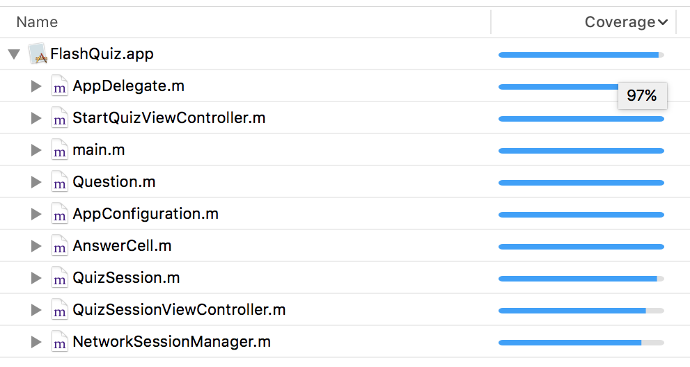

# FlashQuiz

Sample project which features unit tests written in Objective-C and Swift. The app was initially written without a UI and just state, behavior and tests written in Objective-C. Then the UI was introduced after the state and behavior was tested and ready. Approaching the development process in this way ensured the code was functional and testable without UI. Now changes require less work because the UI is decoupled from the state and behavior.

Once the app was completed the tests written in Swift were added and the code supporting the state and behavior was updated to work with Swift. Adding `nonnull` and `nullable` details to the Objective-C code was necessary as well as managing bridging headers in the app and test target.

## Code Coverage

With the focus on making the state and behavior testable it was possible to achieve a very high code coverage from the start. Coverage is as high as 97% as shown in the screenshot below. The state and behavior which is in the model classes is testable directly. Then loading the view controllers from the application delegate allows for navigating to different screens and calling methods for user interactions, reaching more lines of code in the automated tests.

Many tests are unit tests while there are some integration tests which build on the functionality which is covered by unit tests.

# License

MIT

# Credit

Brennan Stehling - 2016

http://github.com/brennanMKE
